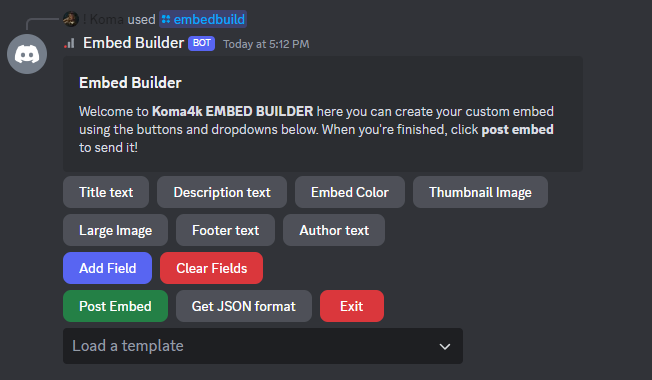

# 🤖 Discord Embed Builder Bot

A powerful Discord bot that allows server administrators to create, customize, and manage embeds through an interactive interface.

## ✨ Features

🎨 Interactive embed builder with real-time preview 
🛠️ Customizable elements: 
  • Title and description 
  • Color picker (hex/name support) 
  • Thumbnail and large images 
  • Author information 
  • Footer with optional icon 
  • Multiple fields (inline/non-inline) 
💾 JSON template support 
🔒 Administrator-only access 
🚀 Hybrid commands (both slash and prefix commands)

## 🔧 Installation

Clone the repository 

<pre>
git clone https://github.com/Koma4k/discord-embed-builder.git
cd discord-embed-builder
</pre>

Install required dependencies 

<pre>
pip install -r requirements.txt
</pre>

Configure the bot 
• Rename `config.example.yml` to `config.yml` 
• Fill in your bot token and preferred settings 

Start the bot 

<pre>
python bot.py
</pre>

In Discord, run the following: 

<pre>
$sync guild or $sync globally
</pre>

To start the embed building process run: 

<pre>
/embedbuild
</pre>

## 🎮 Usage

Use the interactive buttons to customize your embed: 
📝 Title text 
📄 Description text 
🎨 Embed Color 
🖼️ Thumbnail Image 
🌅 Large Image 
👤 Author text 
📊 Add Field 
🗑️ Clear Fields 
📤 Post Embed 
💾 Get JSON format

## 🛠️ Commands

### Administrator Commands
`/embedbuild` - Start the embed builder interface

### Owner Commands
`/sync [scope]` - Sync slash commands (scope: global/guild) 
`/unsync [scope]` - Unsync slash commands 
`/load [cog]` - Load a cog 
`/unload [cog]` - Unload a cog 
`/reload [cog]` - Reload a cog 
`/shutdown` - Shutdown the bot

## 📋 Requirements

Python 3.8+ 
discord.py 2.0+ 
PyYAML 
matplotlib

## 🔒 Security

Ensure your bot token remains private 
Only server administrators can use the embed builder 
Only the bot owner can use management commands

